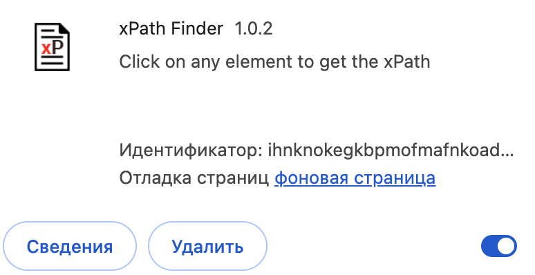
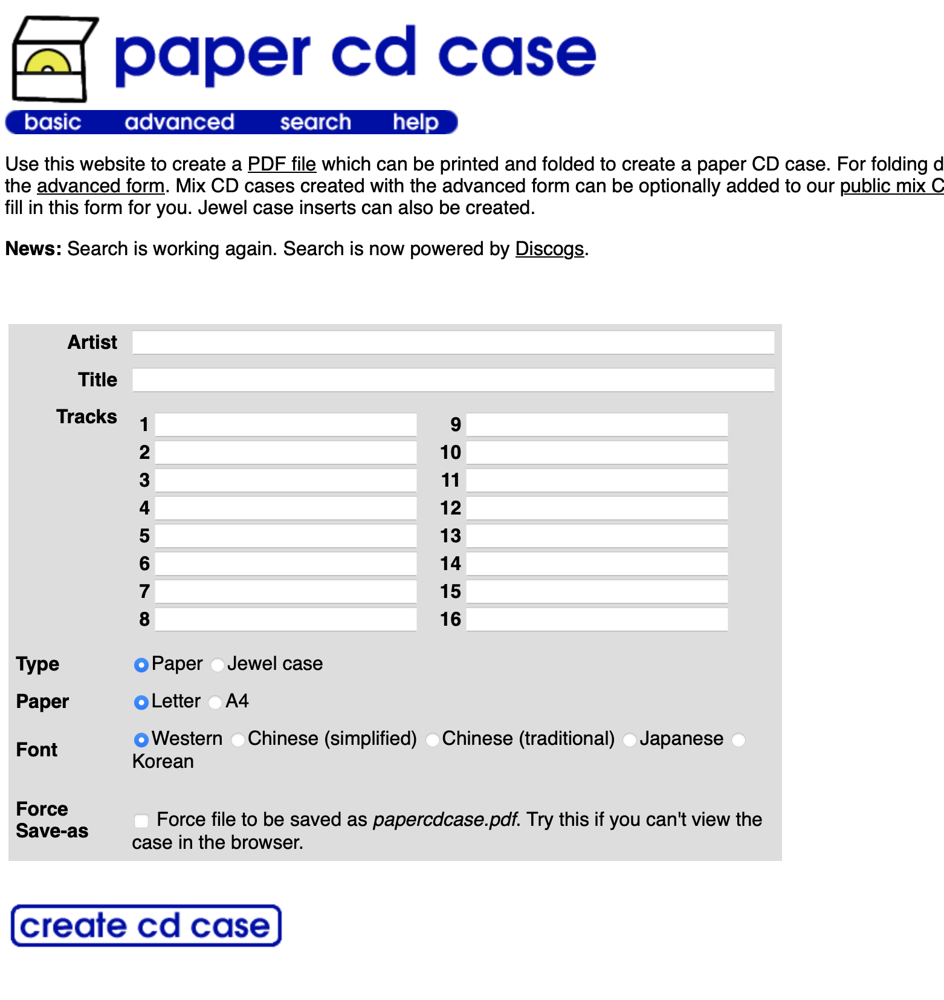

# ST-8 Тестирование web-приложений с использованием Java и фрейморка Selenium (2)


Срок выполнения задания:

**по 24.05.2026** 

## Подготовка к выполнению работы

- установить браузер Google Chrome последних версий
- скачать со страницы [Chrome for Testing availability](https://googlechromelabs.github.io/chrome-for-testing/) версию драйвера, соответствующую установленной версии браузера
- для браузера Google Chrome скачать расширение **xpath**



## Задание №1

Создать проект **Maven** по шаблону **quickstart**.

В **pom.xml** поместить зависимость **Selenium-Java**:

```xml
    <dependency>
      <groupId>org.seleniumhq.selenium</groupId>
      <artifactId>selenium-java</artifactId>
      <version>4.15.0</version>
    </dependency>

```

## Задание №2

Открыть в отдельной сессии браузера Chrome страницу по адресу **www.papercdcase.com**
Содержимое страницы должно выгледеть примерно так:



> [!WARNING]
> **Внимание!**. Браузер может открывать страницу с задержкой или ругаться, что у сайта истек срок сертификата. На самом деле, данный ресурс очень старый и может вызывать проблемы у современных браузеров, что никак не сказывается на программном взаимодействии через Selenium. Можно поэкспериментировать, вручную указывая протоколы: **HTTP** или **HTTPS** в строке адреса.

С помощью расширения **xpath** выделить на странице ключевые элементы (поля Artist, Title, Tracks, Type, Paper, кнопку с надписью ниже формы) и скопировать в блокнот их адреса.

Подготовить данные для обложки компакт-диска (исполнитель, название альбома и список не более чем 18 треков) на английском языке (!)

Данные для обложки сохраняются в текстовом файле `data.txt`

## Задание №3

- использовать базовый адрес страницы на [papercase](www.papercdcase.com)
- при помощи оператора фрейморка Selenium `webDriver.findElement` получить доступ к элементам формы
- используя метод `.sendKeys()` для полей ввода впечатать данные исполнителя, альбома и треков в форму. Данные для формы загружаются из файла `data.txt`
- программно выбрать значения кнопок-переключателей (формат a4, Jewel Case)
- программно активировать кнопку генерации обложки: `btn.submit()`
- получить сформированный PDF-файл с раскройкой обложки для CD и сохранить его в `result` под именем `cd.pdf`

## Состав проекта

- Файл `src/App.java` с кодом скрипта, использующего Selenium-операторы
- Файл `data/data.txt` с данными для формирования обложки
- Сформированный PDF-файл, сохраненный как `result/cd.pdf`

## Подготовка к запуску

### 1. Установка зависимостей через Maven

```bash
mvn dependency:copy-dependencies
```

Это скачает все зависимости (включая Selenium) в папку `target/dependency/`.

### 2. Скачивание ChromeDriver

- Скачайте ChromeDriver, соответствующий вашей версии Chrome:
  https://googlechromelabs.github.io/chrome-for-testing/
- Распакуйте бинарь в папку `drivers/` проекта  
  Или установите переменную окружения `CHROMEDRIVER_PATH` на путь к chromedriver

### 3. Подготовка данных

Отредактируйте `data/data.txt` в формате:

```
artist=Исполнитель на английском
title=Название альбома на английском
track=Название первого трека
track=Название второго трека
...
track=Название последнего трека
```

Максимум 18 треков.

Пример:

```
artist=The Beatles
title=Abbey Road
track=Come Together
track=Something
track=Maxwell's Silver Hammer
track=Oh! Darling
```

### 4. Компиляция и запуск

```bash
# Компиляция
javac -cp "target/dependency/*" -d out src/App.java

# Запуск
java -cp "target/dependency/*:out" App
```

После успешного выполнения в папке `result/` появится файл `cd.pdf`.
